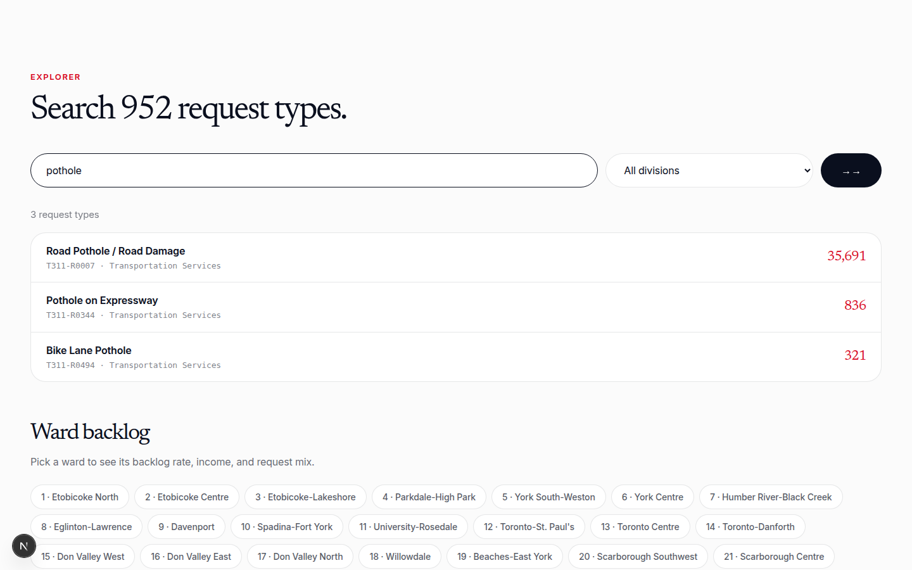
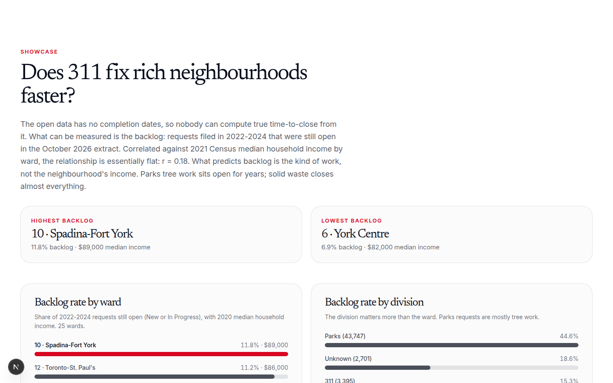

# toronto-311-taxonomy

Toronto's 311 service requests, normalized into a versioned taxonomy, with a ward-by-ward backlog analysis. Nshipyard Canada project 05.

Toronto's 311 line logs millions of service requests a year as 952 free-text request types across 9 city divisions. This project is the join the City never published: every request type mapped into a clean division > section > type hierarchy with stable codes (T311-D, T311-S, T311-R), plus a backlog analysis that answers "does 311 fix rich neighbourhoods faster?" with 2,225,151 requests filed between 2022 and 2026.

An open-source civic project. Not affiliated with the Government of Canada or the City of Toronto.

## Screenshots

## What the data shows

- 2,225,151 requests across 952 types and 9 divisions. Solid Waste Management Services leads with 711,653; Transportation Services follows with 574,495.
- The open dataset has no completion dates, so true time-to-close cannot be computed. The measurable proxy is the backlog: 118,460 requests filed in 2022-2024 were still open in the October 2026 extract (9.2% of that cohort).
- Correlated against 2021 Census median household income by ward, the relationship is essentially flat: r = 0.18. There is no evidence that richer wards get faster resolution.
- What predicts backlog is the kind of work. Parks leaves 44.6% of its 2022-2024 requests open, almost entirely tree work (20,534 General Pruning requests still open). Solid Waste Management closes all but 0.8%.
- Highest backlog ward: Spadina-Fort York (10) at 11.8%. Lowest: York Centre (6) at 6.9%.

## Files

- `data/taxonomy.csv` - 952 request types: division, section, stable code, count, share
- `data/resolution_by_ward.csv` - 25 wards: backlog rate, median household income, division mix
- `data/summary.json` - totals, findings, and methodology notes
- `data/raw/` - source downloads (kept for reproducibility, not committed)

## API

- `GET /api/v1/requests/taxonomy?q=pothole` - search the taxonomy
- `GET /api/v1/requests/wards?code=10` - one ward's backlog profile
- `GET /api/v1/requests/lookup?code=T311-R0007` - one taxonomy code
- `GET /api/v1/requests/summary` - totals and methodology
- `GET /api/openapi.json` - OpenAPI 3.1 spec
- `POST /mcp` - MCP tools: `requests_taxonomy`, `requests_ward_stats`, `requests_lookup`

## License

MIT. Source data is © City of Toronto (open data); the taxonomy and analysis are original work.

## Author

**Richardson Dackam** - [X (@richardsondx)](https://x.com/richardsondx) · [GitHub](https://github.com/richardsondx)
